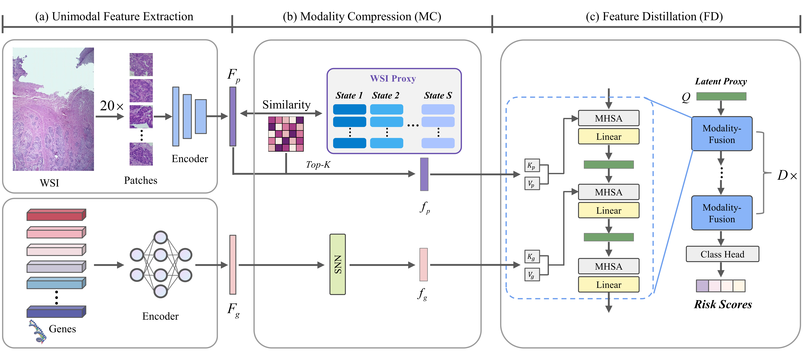

# MCFD
Official respository for MCFD.
<summary>
  <b>Efficient Multimodal Cancer Survival Prediction via Modality Compression and Feature Distillation</b>
</summary>




### Prepare your data
#### WSIs
1. Download diagnostic WSIs from [TCGA](https://portal.gdc.cancer.gov/)
2. Use the WSI processing tool provided by [CLAM](https://github.com/mahmoodlab/CLAM) to extract resnet-50 pretrained 1024-dim feature for each 256 $\times$ 256 patch (20x), which we then save as `.h5` files for each WSI.

#### Genomics
In this work, we directly use the preprocessed genomic data provided by [MCAT](https://github.com/mahmoodlab/MCAT), downloading the dataset_csv and datasets_csv_sig folders.

## Training-Validation Splits
Splits for each cancer type are found in the `splits/5foldcv ` folder, which are randomly partitioned each dataset using 5-fold cross-validation. Each one contains splits_{k}.csv for k = 1 to 5. 

## Running Experiments
To train MCFD, you use the following generic command-line and specify the arguments:
```bash
CUDA_VISIBLE_DEVICES=<DEVICE_ID> python main.py \
                                      --cancer_style BLCA \
                                      --backbone resnet50_trunc \
                                      --model_type MCFD \
                                      --fusion concat \
                                      --mod path_and_geno \
                                      --num_epoch 20 \
                                      --batch_size 1 \
                                      --bag_loss nll_surv \
                                      --lr 2e-4 \
                                      --reg 1e-5 \
                                      --optimizer adam \
                                      --n_classes 4
```


## Acknowledgements
Huge thanks to the authors of following open-source projects:
- [MCAT](https://github.com/mahmoodlab/MCAT)
- [CLAM](https://github.com/mahmoodlab/CLAM)
- [PORPOISE](https://github.com/mahmoodlab/PORPOISE)
